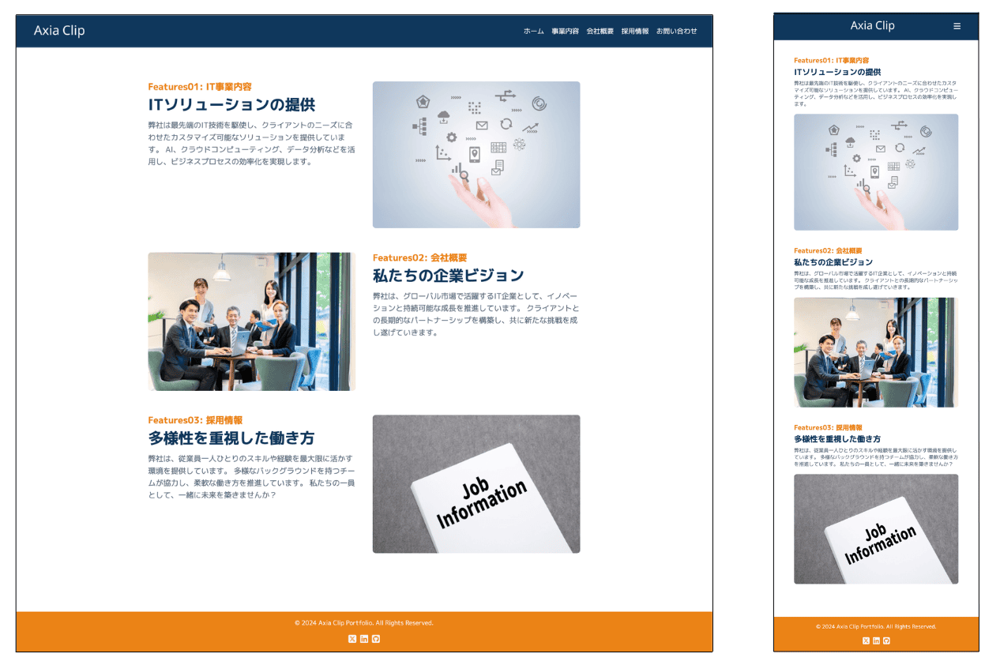

# ポートフォリオサイト

このリポジトリは、IT テック向けの LP ポートフォリオを提供します。

## 技術スタック

- HTML5
- CSS3
- Destyle.css
- JavaScript
- Font Awesome

## デモ

[デモサイトのリンク](https://axiaclip-dev.github.io/it-site-lp-demo/)

### スナップショット

#### 左: PC 版 | 右: スマホ版



## 機能

- スタイリッシュなデザイン（色のアクセントとタイポグラフィ）
- レスポンシブデザイン（PC、タブレット、スマートフォンに対応）
- ハンバーガーメニュー（モバイル向けのナビゲーション）

## ディレクトリ構成

```bash
it-site-lp-demo/
  |- images/
  |- css/
  |- js/
  |- index.html
  |- .gitignore
  |- README.md
```

## インストール

1. リポジトリをクローンします。

```bash
git clone https://github.com/axiaclip-dev/it-site-lp-demo.git
```

## 著作権

ソースコード、ロゴの著作権は Axia Clip にあります。

### 画像の著作権

画像は Free 画像を使用しています。クレジットは以下の通りです。

```bash
- Features01: Photo by [photoAC](https://www.photo-ac.com/main/detail/3735214&title=%E6%89%8B%E3%81%A8%E3%82%A2%E3%82%A4%E3%82%B3%E3%83%B3%E3%80%80%E3%83%86%E3%82%99%E3%82%B7%E3%82%99%E3%82%BF%E3%83%AB%E3%80%80%E3%83%92%E3%82%99%E3%82%B7%E3%82%99%E3%83%8D%E3%82%B9#goog_rewarded)
- Features02: Photo by [photoAC](https://www.photo-ac.com/main/detail/23303526&title=%E3%82%AA%E3%83%95%E3%82%A3%E3%82%B9%E3%81%A7%E5%83%8D%E3%81%8F%E3%83%93%E3%82%B8%E3%83%8D%E3%82%B9%E3%83%91%E3%83%BC%E3%82%BD%E3%83%B3#goog_rewarded)
- Features03: Photo by [photoAC](https://www.photo-ac.com/main/detail/22444392&title=Job+Information#goog_rewarded)
```
